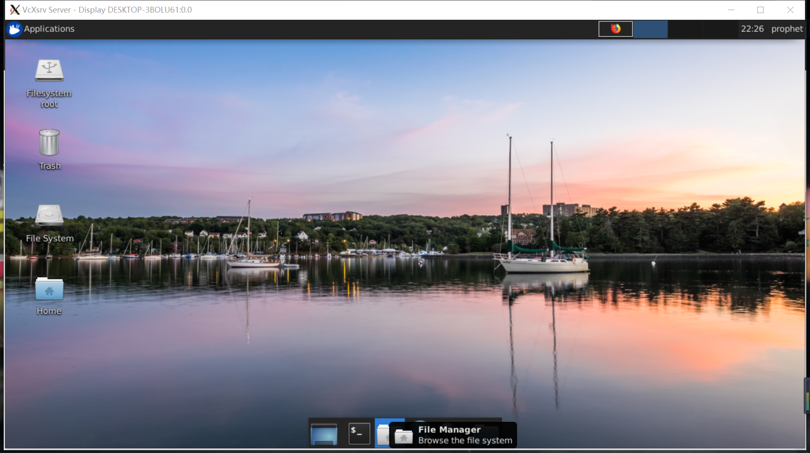
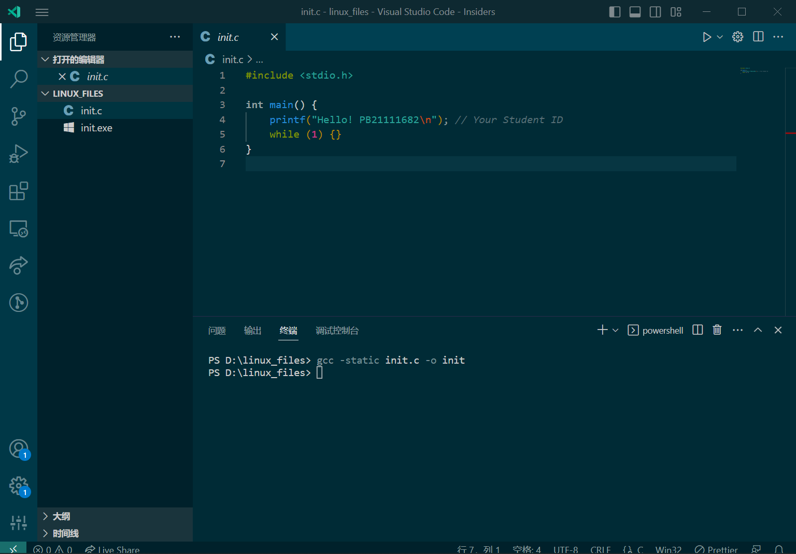
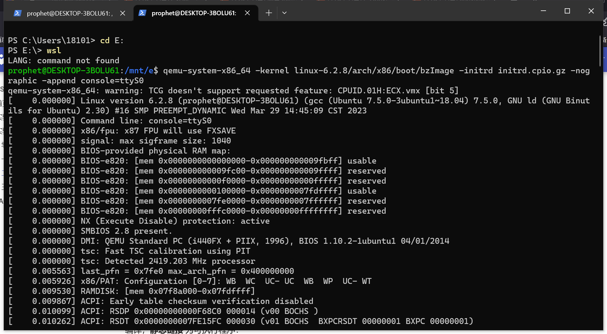

## 实际影响内核编译大小和速度的选项

在尝试裁减linux内核的过程中，除了自主思考权衡，主要参考了以下材料及提示：

- <https://blog.csdn.net/liao20081228/article/details/81389813>
- make xconfig 中GUI界面的自带配置指导提示，如
    
    
- 其余各种组件名词的搜索查询

下面大致罗列裁减内核尝试的过程，从qemu测试过程中的部分进程截图可以看出，其中**标注红色**的一些选项是**必须"enable"**的。
|上手裁剪过程|尺寸变化|
|:--:|:--:|
|defconfig中的初始默认配置|10.9MiB|
|Initial RAM filesystem and RAM disk (initramfs/initrd) support:多种方式转为一种方式Gzip Compiler optimization level:optimize for performance转为optimize for size profiling support/MPS table/Kprobes/Block devices:N Virtualization:N Kernel hacking:N Support for extended (non-PC) x86 platforms:N NUMA Memory Allocation and Scheduler Support:N EFI runtime service support:N Parallel SCSI (SPI) Transport Attributes:N Maintain a devtmpfs filesystem to mount at /dev:N Select only drivers that don't need compile-time external firmware:Y Disable drivers features which enable custom firmware building:Y IOPERM and IOPL Emulation:N Multiple devices driver support (RAID and LVM):N CPU microcode loading support:N IA32 Emulation:N |8.4  MiB|
|/dev/cpu/\*/msr - Model-specific register support:N /dev/cpu/\*/cpuid - CPU information support:N KVM Guest support:N Networking support:N  POSIX Message Queues:N High Resolution Timer Support:N Export task/process statistics through netlink:N Perf controller\RDMA controller:N Build a relocatable kernel:N Performance monitoring:N Mitigations for speculative execution vulnerabilities:N PCCard (PCMCIA/CardBus) support:N Network File Systems\Miscellaneous filesystems\CD-ROM/DVD Filesystems\DOS/FAT/EXFAT/NT Filesystems:N |5.3  MiB|
|ACPI Processor P-States driver:N SCSI device support:N Enable loadable module support:N Block layer debugging information in debugfs:N PNP debugging messages:M Serial ATA and Parallel ATA drivers:N Sound card support:N Support Autodetect IRQ on standard ports\Support RSA serial ports\Support for Pericom and Acces I/O serial ports:N Input device support:N Graphics support AMD Opteron/Athlon64 on-CPU GART\Legacy cpb sysfs knob support for AMD CPUs:N |4.8 MiB|
|kernel crash dumps:N Cryptographic API:N nable seccomp to safely execute untrusted bytecode:N HugeTLB file system support:N IO Schedulers:N |4.29 MiB|
|BSD Process Accounting:N Kernel Compress manner:GZIP转为XZ kexec system call:N |3.32 MiB|
|BSD Process Accounting:Y Initial RAM filesystem and RAM disk (initramfs/initrd) support:Y Enable process_vm_readv/writev syscalls:Y CPU microcode loading support:Y Enable loadable module support:Y |3.46 MiB|
|SCSI Transports:Y /dev/cpu/\*/cpuid - CPU information support:Y /dev/cpu/\*/msr - Model-specific register support:Y |3.59 MiB|
|Networking support:Y |3.82 MiB|

经过多次裁减尝试后大致总结出如下几个会影响内核编译尺寸的选项

- 内核压缩方式由默认的gzip改为xz（时间换空间）
- 编译优化由默认的优先性能改为优先尺寸
- 与内核进程启动及调度有关的选项如与NVME、SCSI、devtmpfs、EFI、ACPI、BSD、Initamfs/initrd等有关的配置（不可擅动）
- 不必要的额外支持，如对AMD芯片、32bit系统、其他高性能x86平台的支持
- 不必要的外设支持，如声卡、网卡、CD-ROM、DVD等
- 不必要的功能支持，如profiling、Kprobes、kernel hacking、debugging等
- 不必要的数据传输支持，如网络数据传输协议、外设接口数据传输支持等
- 不必要的图处理模块

## initrd程序在何种情况下会造成内核恐慌

> Linux内核在运行其他用户进程前必须先完成一个挂载根文件系统的引导过程，即在自身初始化完成之后需要找到并运行 init 程序。Linux 2.6 kernel 提出了一种新的实现机制，即 initramfs。这是一种 RAM filesystem 而不是 disk。initramfs/initrd实际是一个 cpio 归档（小型根目录），这个目录中包含了启动阶段中必须的驱动模块，可执行文件和启动脚本。当系统启动的时候，bootload会把initrd文件读到内存中，然后把initrd的起始地址告诉内核。内核在运行过程中解压initrd，并把initrd挂载为根目录，然后执行根目录中的init.c程序，让它来自动加载设备驱动程序以及在/dev目录下建立必要的设备节点，这之后就可以mount真正的根目录，并切换到这个根目录中了。

实验过程中发现，即使在init.c程序中加入sleep()延时函数也不会导致内核恐慌，但只要程序末尾不含持续循环语句，如while(1){}，就会导致内核恐慌，原因是：init进程是所有系统进程的父进程，它被内核调用起来并负责调用所有其他进程。 如果任何进程的父进程退出，init进程将成为它的父进程。由此可见init进程将一直存在，不可中断，因此若失去while(1){}这个循环，内核将无法继续调用其他进程，自然会造成内核恐慌。

## 实验过程其他附图

