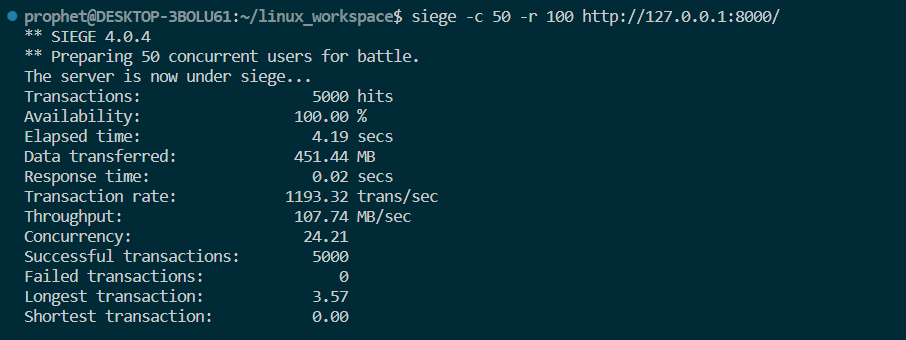
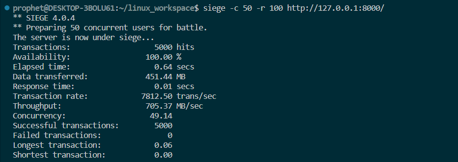

# HTTP Server 编写说明

龚劲铭 PB21111682

## 编译和运行方法说明

1. 需要编译运行文件"server.cpp"（含缓存模块）, 可通过命令行输入"make" 或 "g++ -pthread server.cpp -o server" 进行编译，编译出可执行文件server后，输入"./server" 即可启动服务器
2. 需要编译运行文件"serverv1.cpp"（不含缓存模块）, 可通过命令行输入 "g++ -pthread serverv1.cpp -o serverv1" 进行编译，编译出可执行文件server后，输入"./serverv1" 即可启动服务器
3. 文件"serverv3.cpp"（含缓存及线程池模块），由于c++类定义ThreadPool中内置函数enqueue的某些错误无法编译通过

## 整体设计描述

总体服务器代码框架：

```c++
int main()
{
    create and config server_socket
    bind and listen server_socket
    while(true)//always wait for client request
    {
        create client_socket
        create thread to handle client request
        detach thread and recycle resources
    }
}
```

结构体设计封装：（只需维护相应结构体中的内容就相当于与维护一次服务器与用户之间的连接）

```c++
// HTTP 请求结构体
struct HttpRequest
{
    string method; //用户请求类型如GET
    string path;  //请求资源路径
    string version;  //协议类型（默认为HTTP/1.0）
    vector<pair<string, string>> headers; // 请求头中的键值对如 >Host: 127.0.0.1:8000
    string file_content;  //从请求资源中读取出来的html文件内容
};

// HTTP 响应结构体
struct HttpResponse
{
    string version; //协议类型（默认为HTTP/1.0）
    int status;  //服务器相应状态：200/404/500
    string reason;  //响应信息反馈
    vector<pair<string, string>> headers;
    string file_content;  
};
```

用户请求处理逻辑：

```c++
handle client request()
{
    while(true)  //不断读取client_socket中的请求内容，直到按照HTTP协议读取到两个连续的换行符才停止并跳出循环
    {
        recv(client_sock, buffer, sizeof(buffer) - 1, 0);
        if (strstr(buffer, "\r\n\r\n") != NULL)
            break;
    }
    string request_str(buffer, n); // 类型转换
    HttpRequest request = parse_request(request_str);  //处理用户请求并装入request请求结构体中
    //略：根据得到的request结构体内容判断用户请求是否合法，否则报错断连
    if (request.path.compare("/") == 0)
    {
        request.path += "hello.html";
    }//若请求url为‘/'，则默认请求资源为根目录下的 "hello.html"，便于测试
    HttpResponse respense = make_response(status);  //根据用户请求结构体生成相应的响应结构体
    open and read file from path 
    // 发送响应头和请求的文件资源至用户地址
    int bytes_sent = 0;
    while (bytes_sent < response.size())
    {
        int ret = send(client_sock, response.c_str() + bytes_sent, response.size() - bytes_sent, 0);
        if (ret < 0)
        {
            continue;// 发送失败，进行重试
        }
        bytes_sent += ret;
    }
    close(client_sock);
    return;
}
```

缓存设计思路：

```c++
// 缓存类
const long long CacheSize = 1024 * 1024 * 10; // 10MB
class Cache  //定义缓存类和全局缓存池
{
    public:
        void put(string key, string value)  //往缓存池中存数据
        {
            if (cache_.size() >= CacheSize) //若缓存池满，则删除最先存进的数据
            {
                cache_.erase(cache_.begin());
            }
            cache_[key] = value;
        }

        bool get(string key, string &value) //从缓存池中取数据
        {
            auto it = cache_.find(key);
            if (it != cache_.end())
            {
                value = it->second;
                return true;
            }
            return false;
        }
    private:
        map<string, string> cache_;  
        /*
        std::map 是一个基于红黑树的关联容器，它将键按照一定的顺序进行排序
        std::map 的插入、删除和查找操作的时间复杂度都是 O(log n)
        通过键值对形式来存储文件路径及文件内容
        */
};
// 定义全局缓存池
Cache cache_pool;
//缓存池使用在“ open and read file from path ”部分
{
    string path = "." + request.path; // 加上服务器根目录
    string file_content;
    // 从缓存池中获取数据
    cache_pool.get(path, file_content);
    // 如果缓存池中不存在该资源，则从磁盘上读取
    if (file_content.empty())
    {
        file_content = read_file(path);
    }
    HttpResponse res;
    if (file_content.empty())  //read_file()失败
    {
        res = make_response(404);
    }
    else
    {
        res = make_response(200, file_content);
    }
    // 将最新读取到的数据添加到缓存池中
    cache_pool.put(path, file_content);
}

```

## siege 测试结果和分析

当使用 `siege` 工具进行性能测试时，会生成多个指标来评估被测服务器的性能。

- Transactions：代表完成的请求数量。
- Availability：代表在测试期间服务器的可用性百分比，即在测试期间服务器成功完成请求的比例。
- Elapsed time：代表完成测试的总耗时。
- Data transferred：代表在测试期间传输的数据总量。这包括请求和响应的数据量。
- Response time：代表服务器响应请求所花费的平均时间。
- Transaction rate：代表每秒钟完成的请求数量。
- Throughput：代表每秒钟传输的数据量。
- Concurrency：代表在测试期间并发连接的最大数量。
- Successful transactions：代表成功完成的请求数量。
- Failed transactions：代表失败的请求数量。
- Longest transaction：代表完成时间最长的请求所花费的时间。
- Shortest transaction：代表完成时间最短的请求所花费的时间。

附图：**不含缓存模块**的服务器性能：

 

附图：**含缓存模块**的服务器性能：

 

由此可见，所实现的服务器可用性都较高，在处理用户的GET请求时能较好响应。多线程并发连接的设计可从Concurrency指标看出其重要性。增加缓存模块后（缓存池大小为10MB），响应总耗时从 4.19secs 降至 0.64secs，最长请求响应耗时从 3.57 降至 0.06，吞吐量Throughput和事务处理速率Transaction rate提升近7倍，并发连接最大数量也从 24.21 提升至49.14，可见利用“加速经常性事件”原理，缓存模块的加入提高了服务器的响应速度、吞吐量和并发性，极大提高了服务器的整体性能，能更好地响应大文件的数据传输及高并发需求。
